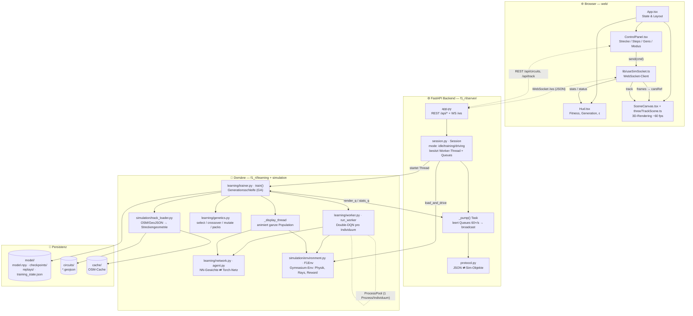
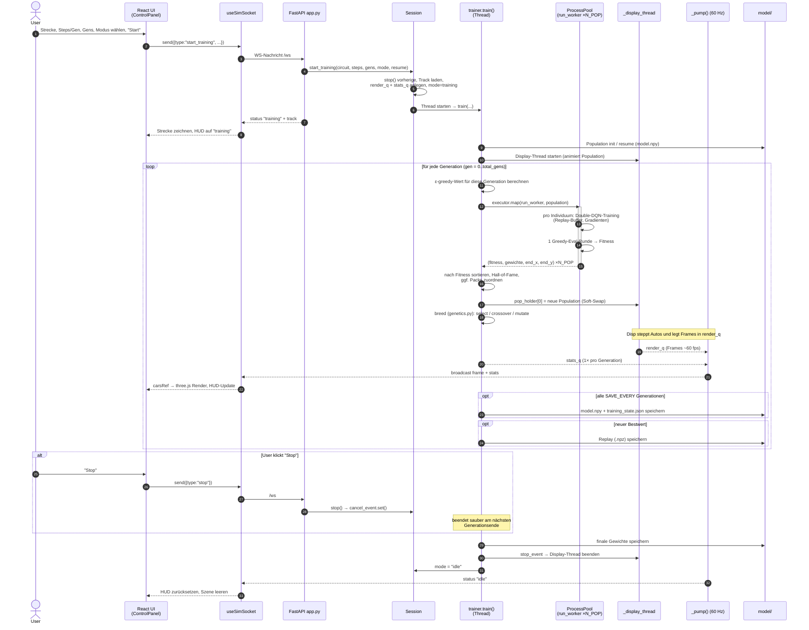

# Architektur — F1 RL Simulator (Web UI)

Dieses Dokument beschreibt die Architektur der **Web-Variante** der Anwendung.
Die alte Pygame-Desktop-UI wurde nach [`old_ui/`](../old_ui) archiviert und ist
für den Web-Betrieb nicht mehr nötig.

## Überblick

Die Anwendung trainiert mit Reinforcement Learning (Genetic Double-DQN) einen
F1-Wagen auf realen Rennstrecken und streamt die laufende Simulation live in den
Browser.

Drei Schichten:

| Schicht | Ordner | Aufgabe |
|---|---|---|
| **Frontend** | `web/` | React + Vite + three.js; rendert Strecke & Autos, sendet Befehle |
| **Backend / Transport** | `f1_rl/server/` | FastAPI: REST + WebSocket, `Session` als Brücke zur Simulation |
| **Domäne** | `f1_rl/learning/`, `f1_rl/simulation/` | RL-Training (GA + DQN) und Fahrphysik/Strecken |
| **Persistenz** | `model/`, `circuits/` | Gewichte, Checkpoints, Replays, Streckengeometrie |

---

## Architekturdiagramm



### Datenflüsse

- **Befehle (Client → Server):** `start_training`, `load_and_drive`, `stop` über
  den WebSocket; Strecken-Metadaten über REST.
- **Frames (Server → Client):** Der `_display_thread` schiebt ~60×/s die
  Zustände aller Autos in `render_q`; `_pump()` nimmt jeweils den neuesten Frame
  und broadcastet ihn. Der Client legt ihn in `carsRef` (kein React-Rerender) —
  three.js liest direkt daraus.
- **Stats (Server → Client):** Einmal pro Generation (Fitness, ε, Generation,
  Top-Scores) über `stats_q` → React-State → HUD.
- **Parallelität:** Pro Generation laufen bis zu `N_POP` Worker-Prozesse
  (`ProcessPoolExecutor`) für das DQN-Training; ein separater Thread animiert
  parallel die Live-Population.

---

## Sequenzdiagramm — Trainingslauf



---

## "Load & Drive" (Kurzform)

Neben dem Training kann ein bereits trainiertes Modell gefahren werden:

1. UI sendet `{type:"load_and_drive", circuit}`.
2. `Session.start_driving()` lädt `model.npy` via `load_policy()` und
   startet einen Thread, der ein einzelnes `F1Env` mit 60 fps fährt.
3. Frames gehen über `render_q` → `_pump()` → WebSocket → three.js.
   (Keine `stats_q`, da kein Training läuft.)

---

## Verzeichnisstruktur (Web-relevant)

```
hft-intelligent-systems/
├─ web/                      # React/Vite/three.js Frontend
│  └─ src/
│     ├─ App.tsx, components/ (ControlPanel, Hud, SceneCanvas, ui/)
│     ├─ three/TrackScene.ts # 3D-Rendering
│     └─ lib/ (useSimSocket.ts, types.ts, utils.ts)
├─ f1_rl/
│  ├─ config.py              # zentrale Konstanten & Strecken-Liste
│  ├─ server/                # FastAPI: app, protocol, session, __main__
│  ├─ learning/              # trainer, worker, agent, network, genetics
│  └─ simulation/            # environment (F1Env), track_loader, track_render*
├─ model/                    # model.npy, checkpoints/, replays/, training_state.json
├─ circuits/                 # *.geojson Streckendaten
├─ cache/                    # OSM-Cache
└─ old_ui/                   # ⛔ archivierte Pygame-Desktop-UI (nicht für Web nötig)

* track_render.py wird nur vom Pygame-Render-Pfad genutzt; environment.py
  importiert es verzögert (deferred) und der Web-Server triggert es nie
  (render_mode=None).
```

## Starten (Web)

```bash
# Backend (Repo-Root)
python -m f1_rl.server          # http://127.0.0.1:8000

# Frontend
cd web && npm install && npm run dev
```
